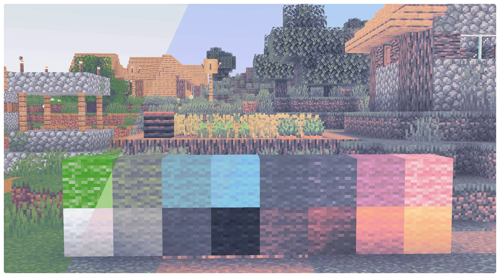
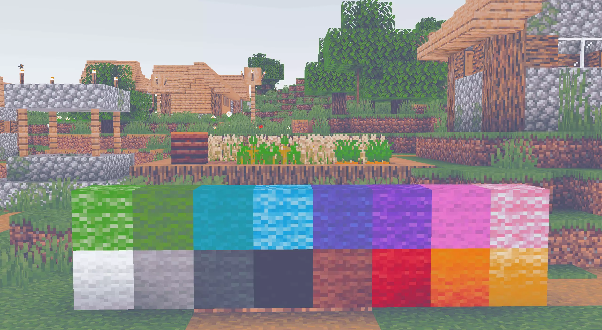
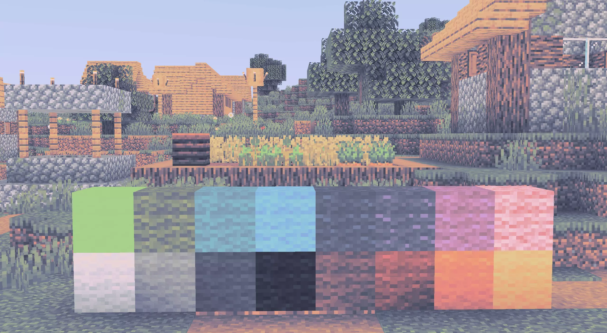
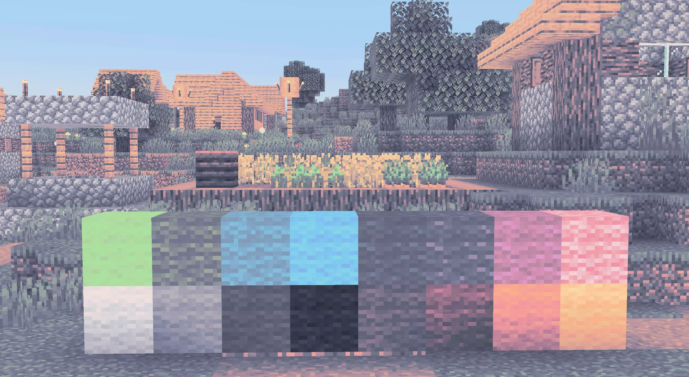

<h3 align="center">
	 
	
	Catppuccin for <a href="https://github.com/catppuccin/optifine">Optifine</a>
	
</h3>

	
	
	

	

## Previews

🌻 Latte

🪴 Frappé

🌺 Macchiato

🌿 Mocha

## Usage

### With Iris (Recommended)
1. Install Iris and Sodium
2. Start the game and go to Options -> Video -> Shader Packs and press on the "Open Shader Pack folder" button.
3. Clone or download this repository to the folder.

### With Optifine
1. Install Optifine
2. Start the game and go to Options -> Video -> Shaders and press on the "Shaders folders" button.
3. Clone or download this repository to the folder.

## 💝 Thanks to

- [Gingeh](https://github.com/Gingeh)

&nbsp;

	

	Copyright &copy; 2021-present <a href="https://github.com/catppuccin" target="_blank">Catppuccin Org</a>

	

